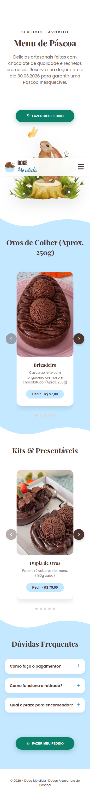
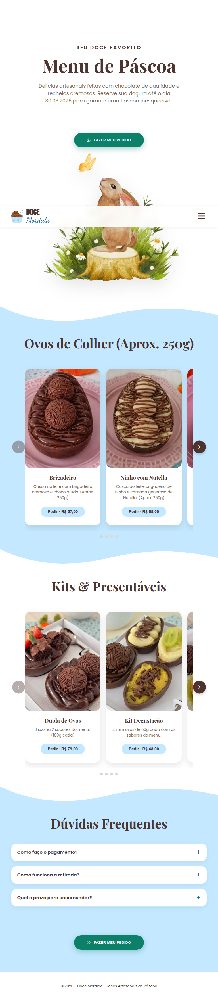
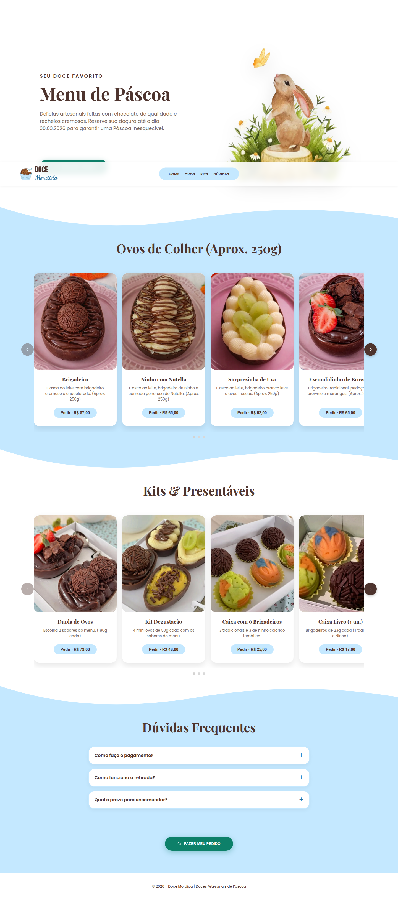

# Doce Mordida

Site institucional e de pedidos da **Doce Mordida**, confeitaria artesanal especializada em doces de Páscoa (ovos de chocolate, kits e presentáveis), localizada em Colombo - PR.

**Publicado em:** [https://docemordidabrigadeiros.com.br/](https://docemordidabrigadeiros.com.br/)

## Sobre o projeto

Página única (landing page) com:

- Hero com identidade visual da marca (logo, título e CTA de pedido);
- Catálogo de produtos em carrosséis responsivos (Ovos de Páscoa e Kits & Presentáveis);
- Modal de pedido com quantidades por item, subtotal em tempo real e envio do pedido via WhatsApp;
- Lightbox para visualizar as imagens dos produtos;
- Menu mobile acessível (drawer/pill com `aria-expanded`) e navegação âncora;
- Layout **mobile-first**: os cards do carrossel se adaptam por faixa de largura — 1 card até 470px, 2 cards até 828px, 3 cards até 1023px e grade fixa no desktop (≥1024px).

## Stack utilizada

| Camada | Tecnologia |
| --- | --- |
| Marcação | HTML5 semântico (landing page única, `index.html`) |
| Estilo | CSS3 puro (tokens via variáveis, `clamp()` para tipografia/padding fluida, breakpoints mobile-first) |
| Lógica | JavaScript puro (vanilla, sem frameworks) — `script.js` |
| Testes | [Playwright](https://playwright.dev) (`@playwright/test`) com 3 projetos: mobile (375px), tablet (768px) e desktop (1440px) |
| Auditoria | Lighthouse (devDependency) |
| Hospedagem | GitHub Pages (arquivo `CNAME`) |
| Servidor local de desenvolvimento | `python3 -m http.server` (sem build/transpilador) |

## Regras de negócio

### Explícitas

- Pedidos são feitos **somente via WhatsApp**; o site não processa pagamento.
- Número de produção: `5541996309958` — **não alterar**. Testes injetam um número de teste via `window.WHATSAPP_NUMBER`.
- Tabela de preços fixa (catálogo em `script.js`, `CATALOGO`): Ovo Brigadeiro R$ 57, Ovo Ninho com Nutella R$ 65, Ovo Surpresinha de Uva R$ 62, Ovo Escondidinho de Brownie R$ 65, Ovo de Maracujá R$ 62, Dupla de Ovos R$ 79, Kit Degustação R$ 48, Caixa com 6 Brigadeiros R$ 25, Caixa Livro (4 un.) R$ 17, Caixa com 2 un. R$ 8.
- Quantidade mínima por item: 0 (zero) — itens com quantidade 0 não entram no pedido.
- Subtotal calculado em tempo real e exibido no modal (`#valor-total`).
- Pedido vazio não é enviado: exibe mensagem de erro (`role="alert"`).
- Mensagem do WhatsApp inclui itens com preço unitário e total, e finaliza com **"Retirada em Colombo - PR."**.
- Botão "Pedir" nos cards abre o modal com o item pré-selecionado (quantidade 1).
- Entrega/retirada: Colombo - PR (modalidade única, informada na mensagem do pedido).

### Implícitas

- Produtos sazonais de Páscoa: o catálogo é fixo no código (sem backend/banco de dados).
- O site é informativo + gerador de pedido; contato e negociação acontecem fora do site (WhatsApp).
- Identidade visual fixa: paleta `--chocolate`, `--azul-claro` e `--branco`; fontes Anton + Dancing Script.
- Acessibilidade como requisito: navegação por teclado nos modais (foco preso, ESC, Enter/espaço), `aria-label` em controles, `prefers-reduced-motion`.
- Performance: `loading="lazy"` nas imagens dos cards e pré-conexão às fontes.
- Responsividade segue modelo mobile-first sem breakpoint de 768px: clamp() cobre os tamanhos intermediários.

## Estado atual do sistema

Prints de página inteira nas três larguras dos projetos de teste (gerados com Playwright + Chrome):

### Mobile — 375×812

### Tablet — 768×1024

### Desktop — 1440×900

### Testes

Suíte Playwright (3 projetos × 25 testes): **72 passaram, 3 skipped** (menu drawer é mobile-only, skip no desktop), 0 falhas.

| Arquivo | Cobre |
| --- | --- |
| `tests/smoke-foundation.spec.js` | tokens, fontes, reduzir-movimento |
| `tests/smoke-layout.spec.js` | overflow horizontal, hero, tipografia fluida |
| `tests/smoke-carousel.spec.js` | cards por faixa de largura, carrossel, dots e setas |
| `tests/smoke-modal.spec.js` | a11y dos modais, bottom sheet, preços/subtotal, WhatsApp |
| `tests/smoke-menu.spec.js` | menu mobile (aria-expanded, scroll lock) |
| `tests/regression-journey.spec.js` | jornada completa do pedido |

Para rodar: `npx playwright test` (servidor local em `http://localhost:8080`).

Para gerar novos prints: rodar o servidor (`python3 -m http.server 8080`) e usar Playwright com `page.screenshot({ fullPage: true })` nas resoluções desejadas (exemplo no histórico: 375, 768 e 1440).

## Licença

**CC0 1.0 Universal** (domínio público) — conforme o arquivo `LICENSE`. O projeto é livre para uso, modificação e redistribuição, inclusive para fins comerciais, sem exigência de atribuição.